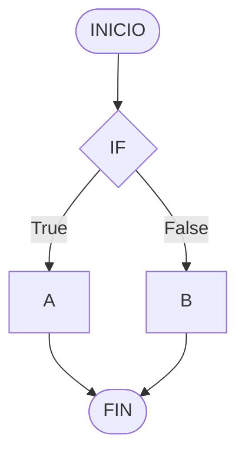

---
aliases:
  - Código en Markdown
  - Code in Markdown
  - Mermaid en Markdown
  - Mermaid in Markdown
author: Mindusting
corrected: true
cssclasses:
  - center-mermaid
headerFile: false
rating: 1
tags:
  - Markdown
  - Mermaid
---

# CÓDIGO EN MARKDOWN

Hay aveces que queremos poder escribir código en un archivo de **Markdown**, para ello, tenemos dos formas de hacerlo: en formato de una **línea** o **block** (*multilínea*); teniendo cada uno su caso de uso.

## LÍNEA DE CÓDIGO

El código de una **línea** nos permite incrustar por ejemplo dentro de un párrafo fragmentos pequeños de código, generalmente usado para referenciar partes de un [**bloque** de código](#BLOQUE%20DE%20CÓDIGO).

Por ejemplo imaginemos que estamos hablando de los bucles en programación que queremos hablar de los bucles *WHILE*, si queremos indicar que la palabra clave a usar es `while` podemos hacerlo mediante el código de **línea** para remarcar con más énfasis que es una **palabra clave** y/o fragmento de código.

Para especificar dónde comienza y termina una **línea** de código se hace mediante la **comilla invertida** (\`), poniendo una al principio y otra al final de la **línea** de código.

> [!abstract] SINTAXIS
> \`***\[codeLine\]***\`

```md
Esto es un texto con una `línea de código` en medio.
```

Si queremos escribir la **comilla invertida** (\`) y que se interprete de forma literal, podemos hacerlo usando una **contrabarra** por delante (\\\`).

---

Cabe resaltar que a veces esta forma de incrustar código tiene sus problemillas; yo personalmente me he encontrado con que cuando estaba haciendo una [tabla](md_table.md) con código dentro y este código contiene un **carácter de tubería** (`|`) la mayoría de intérpretes de **Markdown** (*por lo que yo he visto*) no lo interpreta como yo esperaría que sería, ignorando este carácter.

Veamos el siguiente caso, tenemos una [tabla](md_table.md) con algunos operadores binarios escritos en **líneas de código** junto a su significado:

```md
| OPERADOR | SIGNIFICADO |
|:--------:|:----------- |
|   `!`    | NOT         |
|   `&`    | AND         |
|   `|`    | OR          |
```

Sin embargo el resultado visual de esta [tabla](md_table.md) es el siguiente (*dependiendo del intérprete de Markdown que estés usando quizás no veas nada raro*):

| OPERADOR | SIGNIFICADO |
|:--------:|:----------- |
|   `!`    | NOT         |
|   `&`    | AND         |
|   `|`    | OR          |

Yo lo que veo es que la mayoría de intérpretes terminan mostrado un resultado equivalente a la siguiente [tabla](md_table.md), desapareciendo el `OR`:

```md
| OPERADOR | SIGNIFICADO |
|:--------:|:----------- |
|   `!`    | NOT         |
|   `&`    | AND         |
|    \`    | \`          |
```

Y si te piensas que la solución es poner una **contrabarra** (`\`) para que no lo interprete como la separación entre las dos columnas, no funciona, ahí sí lo interpreta como código incluyendo la **contrabarra** (`|`):

```md
| OPERADOR | SIGNIFICADO |
|:--------:|:----------- |
|   `!`    | NOT         |
|   `&`    | AND         |
|   `\|`   | OR          |
```

Aquí se puede ver el resultado:

| OPERADOR | SIGNIFICADO |
|:--------:|:----------- |
|   `!`    | NOT         |
|   `&`    | AND         |
|   `\|`   | OR          |

La única forma que he encontrado de poner un **carácter de tubería** dentro de una [tabla](md_table.md) es mediante la **contrabarra** (`\`), pero todavía no he encontrado la forma de hacerlo dentro de una **línea de código**.

```md
| OPERADOR | SIGNIFICADO |
|:--------:|:----------- |
|    \!    | NOT         |
|    \&    | AND         |
|    \|    | OR          |
```

| OPERADOR | SIGNIFICADO |
|:--------:|:----------- |
|    \!    | NOT         |
|    \&    | AND         |
|    \|    | OR          |

## BLOQUE DE CÓDIGO

El **bloque** de código se usa cuando queremos mostrar una porción grande de código en nuestro archivo de **Markdown**, bien para ponerlo como ejemplo, documentarlo, o para mostrar el contenido de otro archivo (*por ejemplo el de un archivo de configuración*).

Para definir un bloque de **código** se hace usando tres o más **comillas invertidas** (\`) como apertura y otro igual como cierre del **bloque** de código; entre esta apertura y cierre es donde escribiremos el código; además justo después de la apertura podremos indicar el **tipos de contenido** (*siendo este opcional*) que hay en el **bloque**, esto puede ayudar al lector a saber cómo debe interpretar el contenido e incluso, esto puede hacer que los intérpretes de **Markdown** muestre el código con colores para facilitar la lectura:

> [!abstract] SINTAXIS
> \`\`\`***\{type\}***
> ***\[code\]***
> \`\`\`

Por ejemplo podemos mostrar un código de [**Python**](../../programming/language/python/py.md):

```python
print("Hola mundo!")
```

O el contenido de un [**JSON**](../../programming/data_format/json.md):

```json
{
    "id": 1,
    "name": "Adelio",
    "birthdate": "2000-01-01"
}
```

---

Otra cosa que podemos hacer es crear un **bloque** de código que contendrá **Markdown** en su interior, pero si queremos que este contenga otro **bloque** de código en su interior, no podremos hacerlo de la misma forma ya que los intérpretes no tienen forma de diferencia que cierre del **bloque** corresponde a qué apertura; para solucionar esto lo que se hace es definir los bloques con un número distinto de **comillas invertidas**.

Por ejemplo, si queremos mostrar el siguiente contenido de **Markdown** el cual contiene bloques de código en su interior:

````md
Por ejemplo podemos mostrar un código de **Python**:

```python
print("Hola mundo!")
```

O el contenido de un **JSON**:

```json
{
    "id": 1,
    "name": "Adelio",
    "birthdate": "2000-01-01"
}
```
````

Tendremos que hacerlo de la siguiente forma:

`````md
````md
Por ejemplo podemos mostrar un código de **Python**:

```python
print("Hola mundo!")
```

O el contenido de un **JSON**:

```json
{
    "id": 1,
    "name": "Adelio",
    "birthdate": "2000-01-01"
}
```
````
`````

Como puedes ver, lo único que se ha tendido que hacer es añadir al **bloque** de código exterior un par extra de **comillas invertidas**, de esta forma los intérpretes sí saben dónde comienza y termina cada uno; este mismo proceso lo podemos repetir todas las veces que queramos, añadiendo un nuevo par de **comillas invertidas** a medida que vamos exteriorizando más en los **bloques** de código; de esta forma podremos conseguir todos los **bloques** de código trufados que necesitemos.

### INTEGRACIÓN CON MERMAID

Los bloques de código pueden adquirir nuevos comportamientos cuando especificamos un formato en concreto como por ejemplo [*Mermaid*](../mermaid/mermaid.md), de forma que si escribimos código válido dentro de este **bloque de código**, el interprete del documento puede incrustar el resultado de ese código en la propia nota:

````md

````


Dependiendo del intérprete de **Markdown** que estés usando puede que no veas el diagrama y veas simplemente el código que representa este diagrama o incluso que te salga un error indicando que no sabe cómo interpretar ese código.

%%

# DOCUMENTACIÓN ANTIGUA DE CÓDIGO EN MARKDOWN

Los archivos de Markdown suelen estar relacionados a la programación, esto es debido a que los archivo Markdown contienen texto plano, siendo estos archivos, ligeros y sencillo, con ciertas ventajas como puede ser la posibilidad de escribir código en el propio archivo de Markdown, para ello se hace uso del carácter *acentuación grave* (`<code></code>`).

## LÍNEA DE CÓDIGO

> [!fail]- ESTE APARTADO ESTÁ INCOMPLETO
> 
> > [!todo] #TODO

Para poder escribir una sola línea de código, se debe poner una *acentuación grave* para escribir el código y otra *acentuación grave* para cerrar el código.

> [!example] Ej. de uso de línea de código con sintaxis de MD:
> 
> ```md
> Para imprimir en Python se usa la función `print()`.
>
> **Ej:**
> `print("Hola mundo!!!")`
> ```
> 
> > [!quote] Así es como se la línea de código:
> > Para imprimir en Python se usa la función `print()`.
> > 
> > **Ej:**
> > `print("Hola mundo!!!")`

## BLOQUE DE CÓDIGO

Para poder escribir un bloque de código, se debe poner tres *acentuaciones graves* para escribir el bloque de código y otras tres *acentuaciones graves* para cerrar el bloque de código.

> [!example] Ej. de bloque de código con sintaxis de MD:
> 
> ````md
> ```python
> import math
>
> def distance(dx: float, dy:float):
>     return math.sqrt((dx * dx) + (dy * dy))
>
> print(distance(1, 1))
> ```
> ````
> 
> > [!quote] Así es como se ve el bloque de código con sintaxis de MD:
> > 
> > ```python
> > import math
> >
> > def distance(dx: float, dy:float):
> >     return math.sqrt((dx * dx) + (dy * dy))
> >
> > print(distance(1, 1))
> > ```

%%
