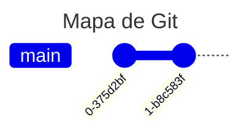

# DIAGRAMA DE GIT EN MERMAID

> [!fail]- ESTE APARTADO ESTÁ INCOMPLETO
> > [!todo] #TODO

> [!help]- REFERENCIAS WEB
> - [Mermaid](https://mermaid.js.org/syntax/gitgraph.html) #WWW/Mermaid

---

```mermaid
---
title: Mapa de Git
---
gitGraph
   commit
   commit
```
