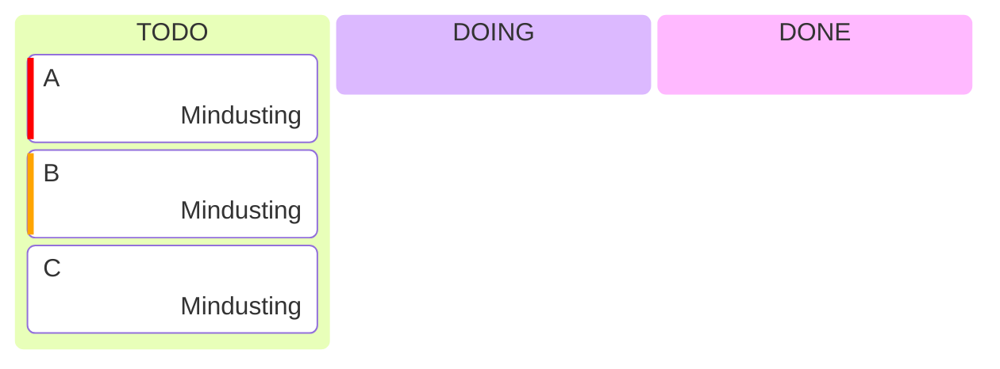

# KANBAN EN MERMAID

> [!fail]- ESTE APARTADO ESTÁ INCOMPLETO
> > [!todo] #TODO

> [!help]- REFERENCIAS WEB
> - [Mermaid](https://mermaid.js.org/syntax/kanban.html) #WWW/Mermaid

%%

```mermaid
kanban
    TODO
        [A]@{
            assigned: 'Mindusting'
            priority: 'Very High'
        }
        [B]@{
            assigned: 'Mindusting'
            priority: 'High'
        }
        [C]@{
            assigned: 'Mindusting'
        }
    DOING
    DONE
```
%%
