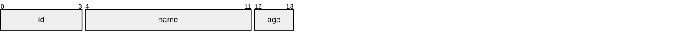
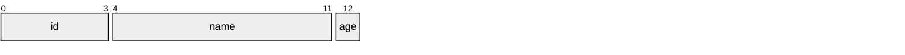

# DIAGRAMA DE PAQUETE EN MERMAID

> [!fail]- ESTE APARTADO ESTÁ INCOMPLETO
> > [!todo] #TODO

> [!help]- REFERENCIAS WEB
> - [Mermaid](https://mermaid.js.org/syntax/packet.html) #WWW/Mermaid

```mermaid
packet-beta
0-3: "id"
4-11: "name"
12-13: "age"
```

```mermaid
packet
+4: "id"
+8: "name"
+1: "age"
```
