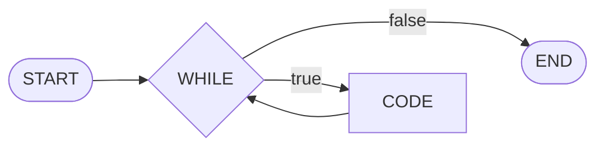
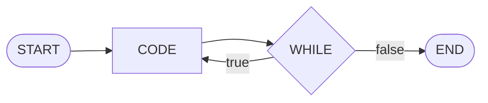
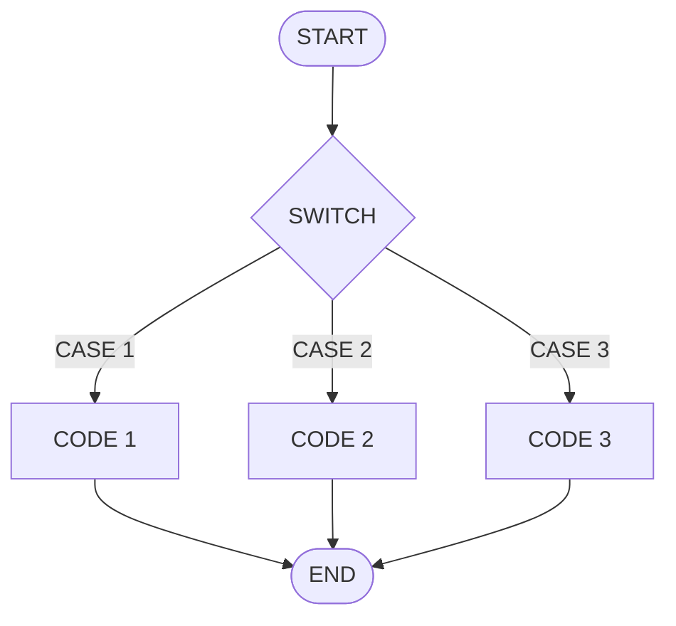
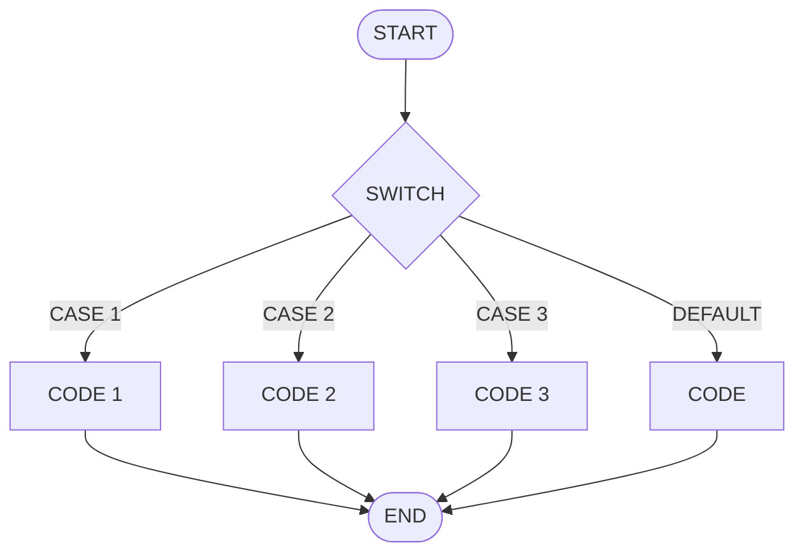
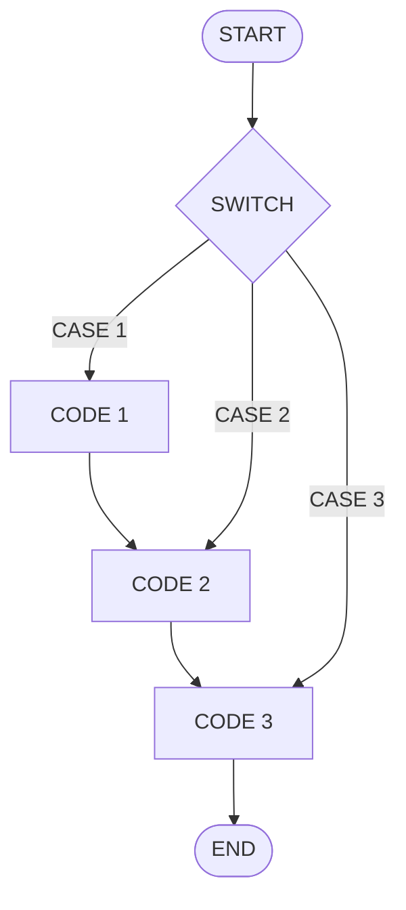
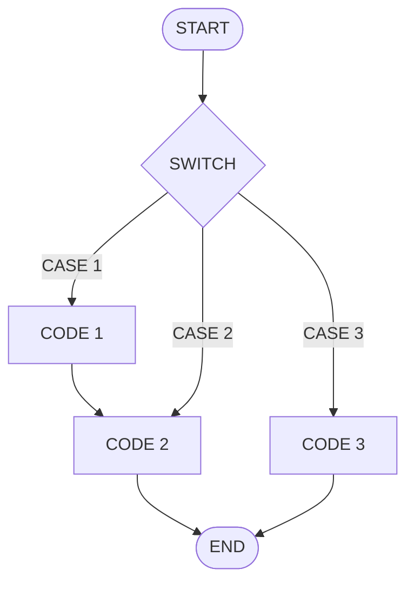
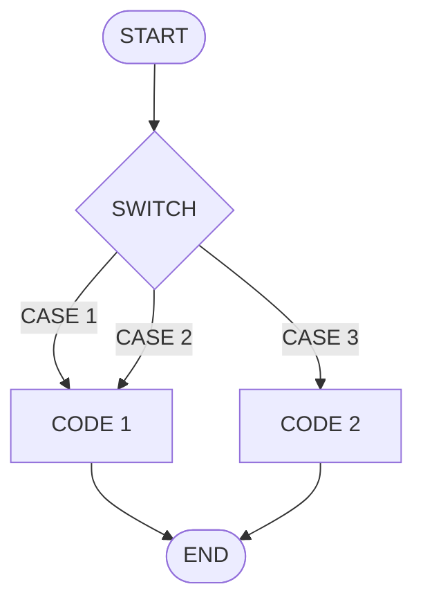

# CONTROL DE FLUJO EN PROGRAMACIÓN

> [!unfinished-file]- ESTE APARTADO ESTÁ INCOMPLETO
> > [!todo] #TODO
> > - [ ] Explicar que la condición tanto para los condicionales como para los bucles no tiene por qué ser una expresión comparatiba.
> > - [ ] Explicar que los valores booleanos se pueden usar como valor literal en el condicional, no hace falta compararlo con algo.
> > - [ ] En el apartado de [condicionales que establecen valores booleanos](#CONDICIONALES%20QUE%20ESTABLECEN%20VALORE%20BOOLEANOS):
> >     - [ ] Describir la situación en la nos puede suceder algo así.
> >     - [ ] Dar una explicación simple a cerca de por qué es innecesario.
> >     - [ ] Explicar que la forma más compacta y "avanzada" es mediante la comparación y asignación en la misma línea.
> >     - [ ] Explicar que en ambos casos funciona, pero uno es más limpio que otro.
> > - [ ] En el apartado [comparaciones booleanas sobre valores booleanos](#COMPARAIONES%20BOOLEANAS%20SOBRE%20VALORES%20BOOLEANOS)
> >     - [ ] Describir la situación en la nos puede suceder algo así.
> >     - [ ] Dar una explicación simple a cerca de por qué es innecesario.
> >     - [ ] Explicar que los valores booleanos se puede usar directamente en las condiciones sin necesidad de comparación.
> >     - [ ] Explicar que comparar valores booleanos no está mal en ciertos casos ya que podemos encontrarnos con al situación en la que necesitamos el funcionamiento de la puerta lógica XOR, en ese caso tendríamos que usar el operador `!=` entre los dos valores booleanos.
> > - [ ] En el apartado del bucle `while` explicar que este puede ejecutarde de forma indefinida.
> > - [ ] En el apartado del bucle `for` explicar que este se ejecuta una cantidad de veces determinada.
> > - [ ] Explicar que un **switch** no tiene por qué siempre tener un `break` des pués de cada `case`, permitiendo establecer la misma porción de código a dos valores distintos.
> > - [ ] Explicar que los **switch** tienden a ser más eficientes que una secuencia de condicionales y por qué.

## CONDICIONALES

### ERRORES COMUNES SOBRE LOS CONDICIONALES

#### CONDICIONALES QUE ESTABLECEN VALORE BOOLEANOS

```java
int mlOfWhater = 800;

boolean bucketIsEmpty;
// Se comprueba si la cantidad de agua es igual a cero.
if (mlOfWhater == 0) {
    // Si no hay agua el cubo está vacío.
    bucketIsEmpty = true;
} else {
    // Si sí hay agua el cubo no está vacio.
    bucketIsEmpty = false;
}
//           ^
// Este condicional es reduntandte.

System.out.printf("¿El cubo está vacío?: %b\n", bucketIsEmpty);
// SALIDA:
// ¿El cubo está vacío?: false
```

```java
int mlOfWhater = 800;

// Se comprueba si la cantidad de agua es igual a cero
// y se establece el valor de la comparación de forma directa.
boolean bucketIsEmpty = mlOfWhater == 0;
//                    ^
// Se compara y establece el valor en la mima línea.

System.out.printf("¿El cubo está vacío?: %b\n", bucketIsEmpty);
// SALIDA:
// ¿El cubo está vacío?: false
```

#### COMPARAIONES BOOLEANAS SOBRE VALORES BOOLEANOS

> [!note] NOTA
> Los mensajes que hay dentro de los condicionales son de relleno, ya que lo importante es la comparación, por lo que he puesto una referencia (*una broma*), no te preocupes si no lo entiendes, no tiene nada qué ver con el caso.

```java
boolean iHaveBread = true;

// Esta comparación es innecesaria.
//             v
if (iHaveBread == true) {
    System.out.println("I'm goin to teleport bread!");
} else {
    System.out.println("I teleported bread!");
}
```

```java
boolean iHaveBread = true;

// Se puede usar el propipo valor booleano como condición.
//       v
if (iHaveBread) {
    System.out.println("I'm goin to teleport bread!");
} else {
    System.out.println("I teleported bread!");
}
```

## BUCLES

### BUCLE WHILE



### BUCLE FOR

### BUCLE DO-WHILE



### BUCLE FOR-EACH

## SWITCH



### EL CASO POR DEFECTO



### SWITCH EN CASCADA

La ejecución en cascade (*en inglés "fall-through"*) de un **switch** consiste en encadenar varios `case` seguidos sin una separación `break`.





#### MÚLTIPLES CASE A UN CÓDIGO



### ERRORES COMUNES SOBRE LOS SWITCH

- Pensar que un **switch** pueden hacer comparaciones; los **switch** no permiten operaciones como `x >= y` ya que el **switch** está pensado para buscar valores concrestos.
