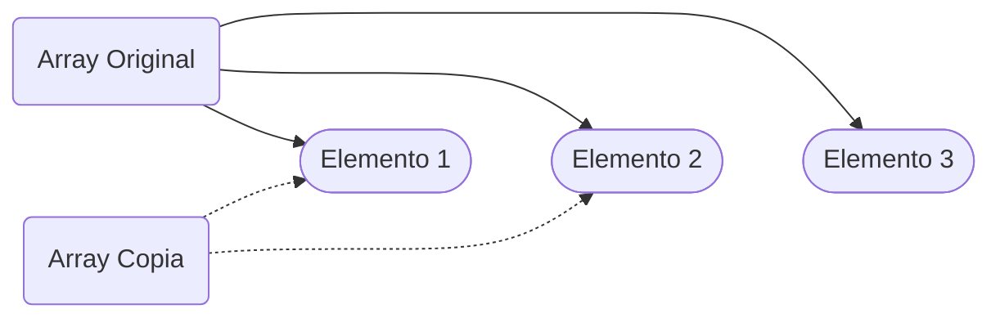

# COPIA PROFUNDA EN PROGRAMACIÓN

> [!fail]- ESTE APARTADO ESTÁ INCOMPLETO
> > [!todo] #TODO

```mermaid
flowchart LR
    ptr1("Array Original")
    ptr2("Array Copia")
    obj1(["Elemento 1"])
    obj2(["Elemento 2"])
    obj3(["Elemento 3"])

    ptr1 ----> obj3
    ptr1 ---> obj2
    ptr1 --> obj1
    ptr2 -.-> obj1
    ptr2 -..-> obj2
    ptr2 ~~~ obj3
```