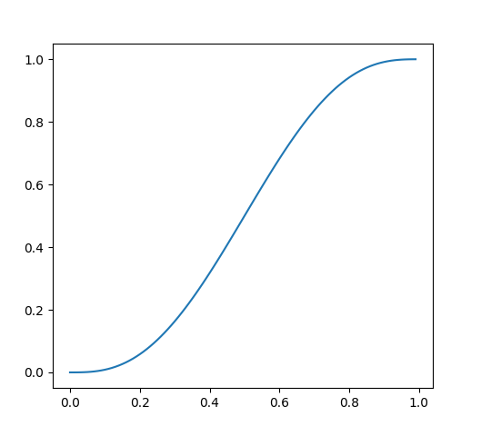

# MATEMÁTICAS

> [!fail]- ESTE APARTADO ESTÁ INCOMPLETO
> > [!todo] #TODO

> [!help]- REFERENCIAS WEB
> YouTube:
> - [The Organic Chemistry Tutor](https://www.youtube.com/@TheOrganicChemistryTutor) #WWW/YT/TheOrganicChemistryTutor
> - [Nic Barker](https://youtu.be/U-ve8Yh4Ro8) #WWW/YT/NicBraker

- [Sistemas numéricos](number_system/math_ns.md)
- [Teoría de conjuntos](sett/sett.md)
- [Vectors](math_vector.md)
- [Trigonometry](trigonometry/trigonometry.md)
- [Matrix](matrix/matrix.md)
- [Pitagoras](math_pitagoras.md)
- [Contar tanques](math_count_tanks.md)
- [Notación de intervalo](math_range_notation.md)
- [Logaritmo](math_log.md)
- [Factorial](math_factorial.md)
- [Raiz cuadrada](math_sqrt.md)

## NÚMEROS

- [Número Aureo](math_golden_ratio.md)

## INTERPOLATION

### FADE

Si queremos hacer transformar una interpolación lineal a una más suavizada podemos usar la siguiente fórmula:

$$
r = 6t^5-15t^4+10t^3
$$

```python
def fade(t: float) -> float:
    if t < 0:   return 0
    elif t > 1: return 1
    return 6*t**5-15*t**4+10*t**3
```

```python
def fade(t: float) -> float:
    if t < 0:   return 0
    elif t > 1: return 1
    return t*t*t*(t*(t*6-15)+10)
```


