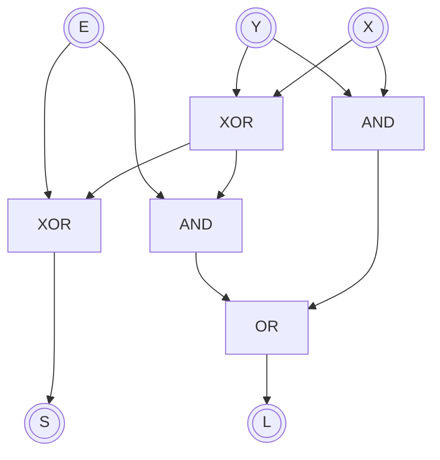

<h1 style="text-align:center;">SUMAR EN BINARIO</h1>

---

> [!fail] ESTE APARTADO ESTÁ INCOMPLETO

| E | Y | X | S | L |
|:-:|:-:|:-:|:-:|:-:|
| 0 | 0 | 0 | 0 | 0 |
| 0 | 0 | 1 | 1 | 0 |
| 0 | 1 | 0 | 1 | 0 |
| 0 | 1 | 1 | 0 | 1 |
| 1 | 0 | 0 | 1 | 0 |
| 1 | 0 | 1 | 0 | 1 |
| 1 | 1 | 0 | 0 | 1 |
| 1 | 1 | 1 | 1 | 1 |

%%



%%

```txt
X────╦──╦═════╗
     │  ║ XOR ╠──╦───╦═════╗
Y─╦──┼──╩═════╝  │   ║ XOR ╠───────────S
  │  │           │ ┌─╩═════╝
E─┼──┼───────────┼─╣
  │  │           │ └─╦═════╗
  │  │           │   ║ AND ╠─┐
  │  │           └───╩═════╝ └─╦════╗
  │  │                         ║ OR ╠──L
  │  └───────────────╦═════╗ ┌─╩════╝
  │                  ║ AND ╠─┘
  └──────────────────╩═════╝
```

```txt
 101
  11 +
-------
1000
```
