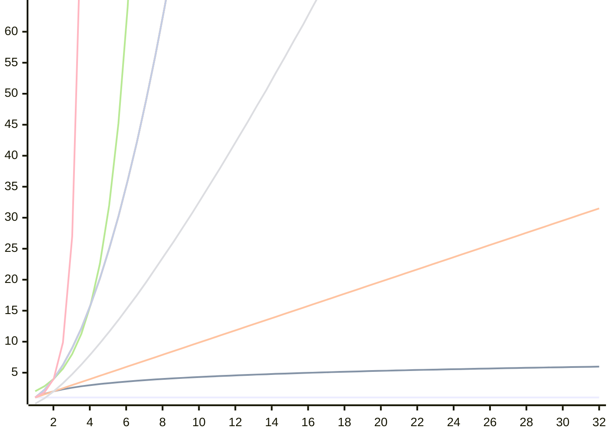

# BIG-O

> [!fail]- ESTE APARTADO ESTÁ INCOMPLETO
> > [!todo] #TODO

> [!help]- REFERENCIAS WEB
> - [Big O](https://www.bigocheatsheet.com) #WWW/BigO
>
> YouTube:
> - [Bro Code](https://www.youtube.com/watch?v=XMUe3zFhM5c) #WWW/YT/BroCode

- `O(1)` = tiempo constante: 
    - Acceso a un [array](data_structures/pc_ds_array.md).
- `O(log n)` = tiempo logarítmico:
    - Búsqueda binaria.
- `O(n)` = tiempo lineal:
- `O(n log n)` = tiempo quasilineal:
- `O(n^2)` = tiempo quadrático:
- `O(n!)` = tiempo factorial:
